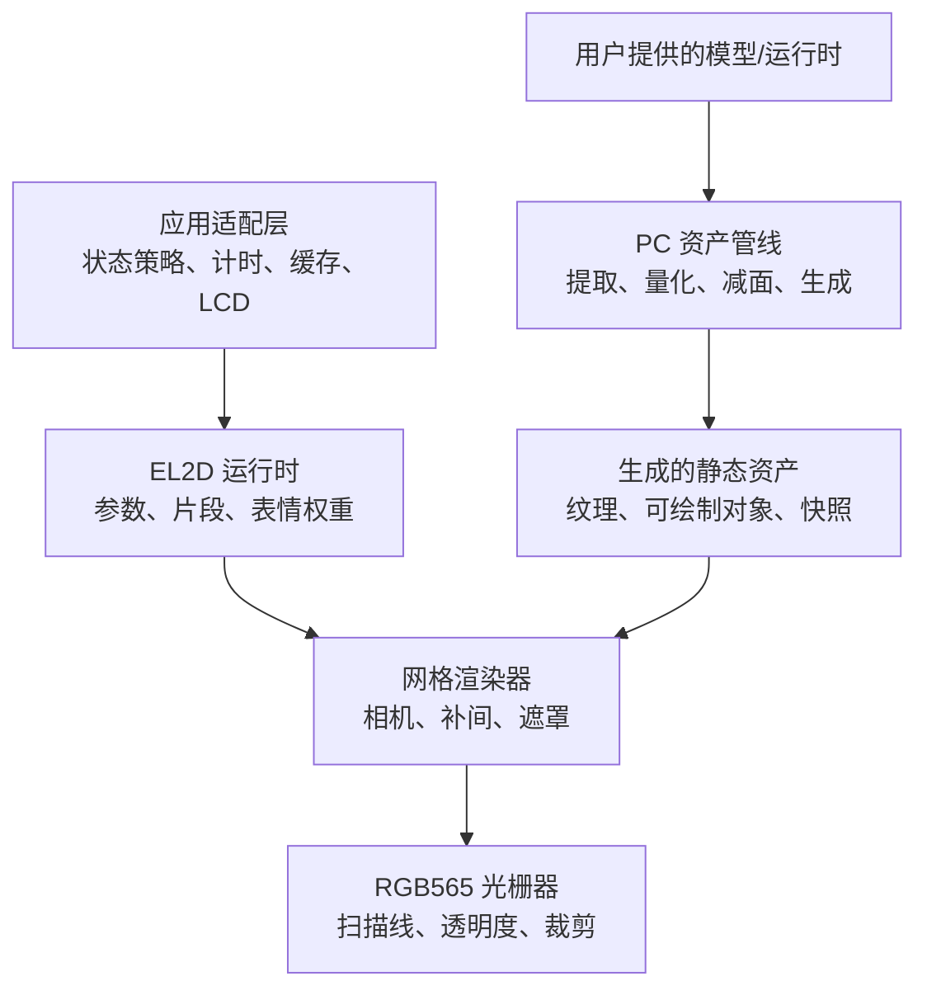
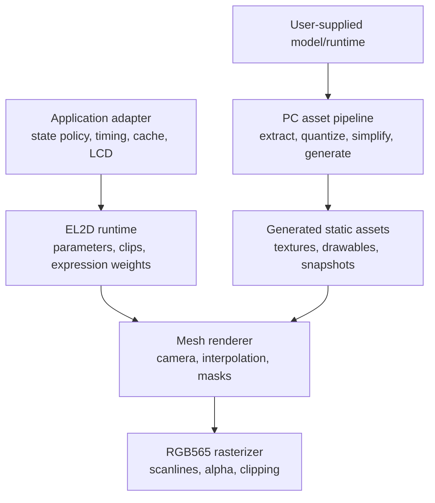

[中文](#中文) | [English](#english)

# 中文

## EL2D Lite 架构（中文）

### 设计目标（中文）

EL2D Lite 将“模型离线求值”和“设备实时显示”分开。PC 处理复杂格式解析、状态采样、纹理转换与减面；ESP32 只保留确定性的补间、表情叠加、遮罩和 RGB565 软件光栅化。

核心约束：

- 运行时与业务状态完全分离。
- 运行时不持有显示设备，不发起 LCD、网络或文件 I/O。
- 模型内存由生成资产或调用方持有，render context 只持有工作缓存和统计。
- 状态快照共享拓扑，过渡期间不做 drawable 淡入淡出替代几何补间。
- 快速面部动作作为增量层叠加，不受较慢身体状态过渡时长限制。

### 分层（中文）



#### Application adapter（中文）

不属于本仓库核心。它将产品状态映射为 `from_model`、`to_model`、camera、transition progress 和 expression layer 权重，并决定何时重绘、何时复用稳定帧、怎样把 framebuffer 发送给屏幕。

#### Runtime（中文）

`include/el2d/model.h` 和 `clip.h` 提供命名参数、通用缓动和曲线采样。参数名称只是字符串；核心没有机器人、聊天或角色状态枚举。

#### Mesh renderer（中文）

`include/el2d/mesh_renderer.h` 定义纹理、drawable、model、camera、expression layer 与 render context。状态补间要求两套模型具有相同 drawable 顺序、顶点数、索引、UV、对应 drawable 的 `texture_index` 和遮罩关系。

基础状态与增量表情的组合公式只适用于顶点位置：

```text
base_position = lerp(state_from_position, state_to_position, state_progress)
final_position = base_position + sum((expression_target_position - expression_reference_position) * weight)
```

drawable 的 opacity 只在基础状态的 `from_model` 与 `to_model` 之间插值，不受 expression layer 叠加；不可见的基础 drawable 按 opacity 0 参与插值。

因此身体可以用 2-3 秒平滑过渡，同时眨眼和口型仍按几十到几百毫秒的独立 envelope 变化。

#### Rasterizer（中文）

`src/el2d_mesh_rasterizer.c` 使用固定点 scanline 热路径，输出 RGB565。纹理输入为 RGB565 与 alpha4 分离数组；遮罩覆盖缓存使用紧凑位图。裁剪范围允许应用只更新 framebuffer 的一部分，但脏区策略仍由应用决定。

#### ESP-IDF component（中文）

`components/el2d` 只封装通用源码和 `esp_timer` 依赖。它不依赖 LVGL、具体 LCD panel、Wi-Fi 或 websocket。`el2d_esp_preview` 是最小编译/接线示例，不是产品角色实现。

### 数据所有权（中文）

| 对象 | 所有者 | 生命周期 |
| --- | --- | --- |
| `el2d_mesh_model` 与纹理数组 | 生成资产/应用 | 通常为整个固件生命周期 |
| RGB565 framebuffer | 应用 | 至少覆盖一次 render 和显示传输 |
| `el2d_mesh_render_context` | 应用 | 可跨帧复用已分配的工作内存；不跨帧复用遮罩覆盖结果 |
| transition/clip 参数 | 应用或 runtime model | 由应用时钟更新 |
| LCD 句柄与 DMA buffer | 应用 | 核心不可见 |

所有静态 model 指针在一次 render 内必须有效。调用方不得在 render 进行时修改纹理、索引或顶点数组。

render context 跨帧保留已分配的顶点、位置和遮罩位图工作内存，以减少重复分配。每次 render 仍会重建所需的遮罩覆盖；只有同一次 render 内使用相同 mask set 的 drawable 才共享该覆盖结果。

### 帧生命周期（中文）

1. 应用读取单调时钟并更新业务状态机。
2. 业务 adapter 计算通用 transition progress、camera 和表情权重。
3. 应用判断量化后的输入是否改变；稳定帧缓存可在这里直接命中。
4. 运行时清理目标区域、变换顶点、构建遮罩（同一帧内复用相同 mask set）并光栅化 drawable。
5. 应用把 RGB565 framebuffer 或脏区发送给 LCD。

运行时不主动限帧。面部 envelope 的 attack/release、随机眨眼间隔和口型采样频率均是应用策略。

### 资产 ABI（中文）

当前设备端稳定路径是生成 C/C++：

- `el2d_mesh_texture[]` 保存 RGB565/alpha4 指针和尺寸。
- `el2d_mesh_drawable[]` 保存位置、UV、索引、render order、透明度与 mask 索引。
- 每个状态/表情快照导出一个 `el2d_mesh_model`，兼容快照共享纹理与拓扑。

`.el2d` 目录目前是包含 `manifest.json`、`metadata.json`、`report.json` 和可选 `drawables.json` 的中间交换格式。设备端二进制 loader、版本迁移和校验尚未定稿，因此不能把 `.el2d` 当作稳定 runtime ABI。

### 扩展点（中文）

- 新提取后端：输出 `el2d-lite.drawable-snapshot` JSON，不进入设备 runtime。
- 新纹理格式：通过扩展 `el2d_mesh_texture` 和 rasterizer sampler 实现，保留旧格式分支。
- 新平台：直接编译 `src/` 并提供单调计时适配；显示驱动留在应用。
- 新业务状态：只在应用 adapter 中增加映射，不修改 runtime 枚举。
- 二进制包 loader：未来应有 magic、版本、边界校验、alignment 和零拷贝策略，再进入稳定 API。

# English

## EL2D Lite Architecture (English)

### Design Goals (English)

EL2D Lite separates offline model evaluation from real-time device display. The PC handles complex format parsing, state sampling, texture conversion, and mesh simplification; the ESP32 retains only deterministic interpolation, expression compositing, masking, and RGB565 software rasterization.

Core constraints:

- The runtime is fully decoupled from application state.
- The runtime owns no display device and initiates no LCD, network, or file I/O.
- Model memory is owned by generated assets or the caller; the render context owns only working buffers and statistics.
- State snapshots share topology. Transitions use geometric interpolation rather than drawable crossfades.
- Fast facial motion is composited as additive layers and is not constrained by the duration of slower body-state transitions.

### Layering (English)



#### Application Adapter (English)

This layer is not part of the repository core. It maps product state to `from_model`, `to_model`, camera, transition progress, and expression layer weights. It also decides when to redraw, when to reuse a stable frame, and how to send the framebuffer to the display.

#### Runtime (English)

`include/el2d/model.h` and `clip.h` provide named parameters, general-purpose easing, and curve sampling. Parameter names are only strings; the core has no enums for robot, chat, or character states.

#### Mesh Renderer (English)

`include/el2d/mesh_renderer.h` defines textures, drawables, models, cameras, expression layers, and render contexts. State interpolation requires both models to have identical drawable order, vertex counts, indices, UVs, corresponding drawable `texture_index` values, and mask relationships.

The base state and additive expressions are combined as follows for vertex positions only:

```text
base_position = lerp(state_from_position, state_to_position, state_progress)
final_position = base_position + sum((expression_target_position - expression_reference_position) * weight)
```

Drawable opacity is interpolated only between the base-state `from_model` and `to_model`; expression layers do not modify it. An invisible base drawable participates in this interpolation with opacity 0.

The body can therefore transition smoothly over 2-3 seconds while blinks and mouth shapes continue to follow independent envelopes lasting tens to hundreds of milliseconds.

#### Rasterizer (English)

`src/el2d_mesh_rasterizer.c` uses a fixed-point scanline hot path and outputs RGB565. Texture inputs are split into RGB565 and alpha4 arrays; the mask coverage cache uses compact bitmaps. The clipping bounds allow an application to update only part of the framebuffer, but the dirty-region policy remains the application's responsibility.

#### ESP-IDF Component (English)

`components/el2d` wraps only the common source code and the `esp_timer` dependency. It does not depend on LVGL, a specific LCD panel, Wi-Fi, or WebSocket. `el2d_esp_preview` is a minimal build and integration example, not a product character implementation.

### Data Ownership (English)

| Object | Owner | Lifetime |
| --- | --- | --- |
| `el2d_mesh_model` and texture arrays | Generated assets/application | Usually the full firmware lifetime |
| RGB565 framebuffer | Application | At least one render and display transfer |
| `el2d_mesh_render_context` | Application | Reuses allocated working memory across frames; does not reuse mask coverage across frames |
| transition/clip parameters | Application or runtime model | Updated by the application clock |
| LCD handle and DMA buffer | Application | Not visible to the core |

All static model pointers must remain valid for the duration of a render. The caller must not modify texture, index, or vertex arrays while rendering is in progress.

The render context retains allocated vertex, position, and mask-bitmap working memory across frames to reduce repeated allocations. Each render still rebuilds the required mask coverage; only drawables that use the same mask set within that render share the coverage result.

### Frame Lifecycle (English)

1. The application reads a monotonic clock and updates its application state machine.
2. The application adapter calculates general-purpose transition progress, camera, and expression weights.
3. The application checks whether the quantized inputs have changed; the stable-frame cache can return a hit at this point.
4. The runtime clears the target region, transforms vertices, builds masks (reusing identical mask sets within the frame), and rasterizes drawables.
5. The application sends the RGB565 framebuffer or dirty region to the LCD.

The runtime does not impose a frame-rate limit. Facial-envelope attack/release, randomized blink intervals, and mouth-shape sampling frequency are all application policies.

### Asset ABI (English)

The current stable device-side path uses generated C/C++:

- `el2d_mesh_texture[]` stores RGB565/alpha4 pointers and dimensions.
- `el2d_mesh_drawable[]` stores positions, UVs, indices, render order, opacity, and mask indices.
- Each state or expression snapshot exports one `el2d_mesh_model`; compatible snapshots share textures and topology.

The `.el2d` directory is currently an intermediate interchange format containing `manifest.json`, `metadata.json`, `report.json`, and an optional `drawables.json`. The device-side binary loader, version migration, and validation have not been finalized, so `.el2d` must not be treated as a stable runtime ABI.

### Extension Points (English)

- New extraction backend: output `el2d-lite.drawable-snapshot` JSON without entering the device runtime.
- New texture format: extend `el2d_mesh_texture` and the rasterizer sampler while retaining a branch for the existing format.
- New platform: compile `src/` directly and provide a monotonic-timing adapter; keep the display driver in the application.
- New application state: add only an application-adapter mapping without modifying runtime enums.
- Binary package loader: before becoming a stable API, a future implementation should define magic, versioning, bounds validation, alignment, and zero-copy policies.
