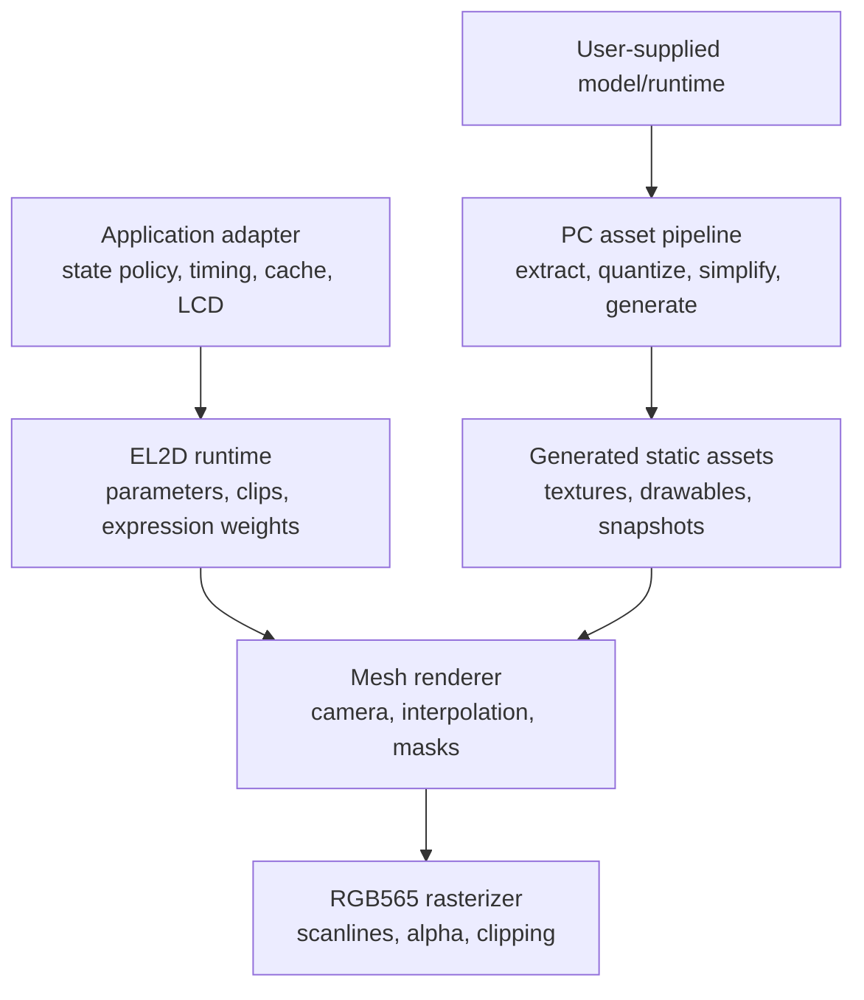

# EL2D Lite 架构

## 设计目标

EL2D Lite 将“模型离线求值”和“设备实时显示”分开。PC 处理复杂格式解析、状态采样、纹理转换与减面；ESP32 只保留确定性的补间、表情叠加、遮罩和 RGB565 软件光栅化。

核心约束：

- 运行时与业务状态完全分离。
- 运行时不持有显示设备，不发起 LCD、网络或文件 I/O。
- 模型内存由生成资产或调用方持有，render context 只持有工作缓存和统计。
- 状态快照共享拓扑，过渡期间不做 drawable 淡入淡出替代几何补间。
- 快速面部动作作为增量层叠加，不受较慢身体状态过渡时长限制。

## 分层



### Application adapter

不属于本仓库核心。它将产品状态映射为 `from_model`、`to_model`、camera、transition progress 和 expression layer 权重，并决定何时重绘、何时复用稳定帧、怎样把 framebuffer 发送给屏幕。

### Runtime

`include/el2d/model.h` 和 `clip.h` 提供命名参数、通用缓动和曲线采样。参数名称只是字符串；核心没有机器人、聊天或角色状态枚举。

### Mesh renderer

`include/el2d/mesh_renderer.h` 定义纹理、drawable、model、camera、expression layer 与 render context。状态补间要求两套模型具有相同 drawable 顺序、顶点数、索引、UV 和遮罩关系。

基础状态与增量表情的组合公式是：

```text
base = lerp(state_from, state_to, state_progress)
final = base + sum((expression_target - expression_reference) * weight)
```

因此身体可以用 2-3 秒平滑过渡，同时眨眼和口型仍按几十到几百毫秒的独立 envelope 变化。

### Rasterizer

`src/el2d_mesh_rasterizer.c` 使用固定点 scanline 热路径，输出 RGB565。纹理输入为 RGB565 与 alpha4 分离数组；遮罩覆盖缓存使用紧凑位图。裁剪范围允许应用只更新 framebuffer 的一部分，但脏区策略仍由应用决定。

### ESP-IDF component

`components/el2d` 只封装通用源码和 `esp_timer` 依赖。它不依赖 LVGL、具体 LCD panel、Wi-Fi 或 websocket。`el2d_esp_preview` 是最小编译/接线示例，不是产品角色实现。

## 数据所有权

| 对象 | 所有者 | 生命周期 |
| --- | --- | --- |
| `el2d_mesh_model` 与纹理数组 | 生成资产/应用 | 通常为整个固件生命周期 |
| RGB565 framebuffer | 应用 | 至少覆盖一次 render 和显示传输 |
| `el2d_mesh_render_context` | 应用 | 可跨帧复用，减少重复分配和遮罩构建 |
| transition/clip 参数 | 应用或 runtime model | 由应用时钟更新 |
| LCD 句柄与 DMA buffer | 应用 | 核心不可见 |

所有静态 model 指针在一次 render 内必须有效。调用方不得在 render 进行时修改纹理、索引或顶点数组。

## 帧生命周期

1. 应用读取单调时钟并更新业务状态机。
2. 业务 adapter 计算通用 transition progress、camera 和表情权重。
3. 应用判断量化后的输入是否改变；稳定帧缓存可在这里直接命中。
4. 运行时清理目标区域、变换顶点、构建/复用遮罩并光栅化 drawable。
5. 应用把 RGB565 framebuffer 或脏区发送给 LCD。

运行时不主动限帧。面部 envelope 的 attack/release、随机眨眼间隔和口型采样频率均是应用策略。

## 资产 ABI

当前设备端稳定路径是生成 C/C++：

- `el2d_mesh_texture[]` 保存 RGB565/alpha4 指针和尺寸。
- `el2d_mesh_drawable[]` 保存位置、UV、索引、render order、透明度与 mask 索引。
- 每个状态/表情快照导出一个 `el2d_mesh_model`，兼容快照共享纹理与拓扑。

`.el2d` 目录目前是包含 `manifest.json`、`metadata.json`、`report.json` 和可选 `drawables.json` 的中间交换格式。设备端二进制 loader、版本迁移和校验尚未定稿，因此不能把 `.el2d` 当作稳定 runtime ABI。

## 扩展点

- 新提取后端：输出 `el2d-lite.drawable-snapshot` JSON，不进入设备 runtime。
- 新纹理格式：通过扩展 `el2d_mesh_texture` 和 rasterizer sampler 实现，保留旧格式分支。
- 新平台：直接编译 `src/` 并提供单调计时适配；显示驱动留在应用。
- 新业务状态：只在应用 adapter 中增加映射，不修改 runtime 枚举。
- 二进制包 loader：未来应有 magic、版本、边界校验、alignment 和零拷贝策略，再进入稳定 API。
